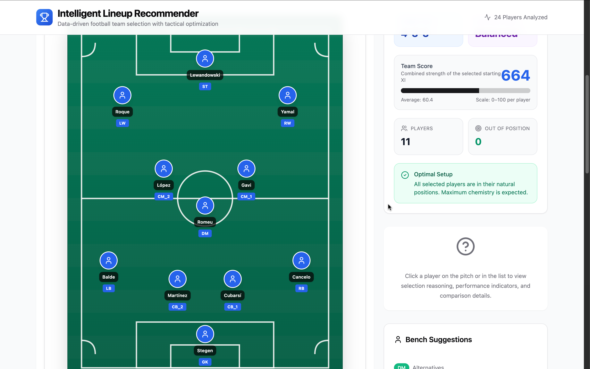
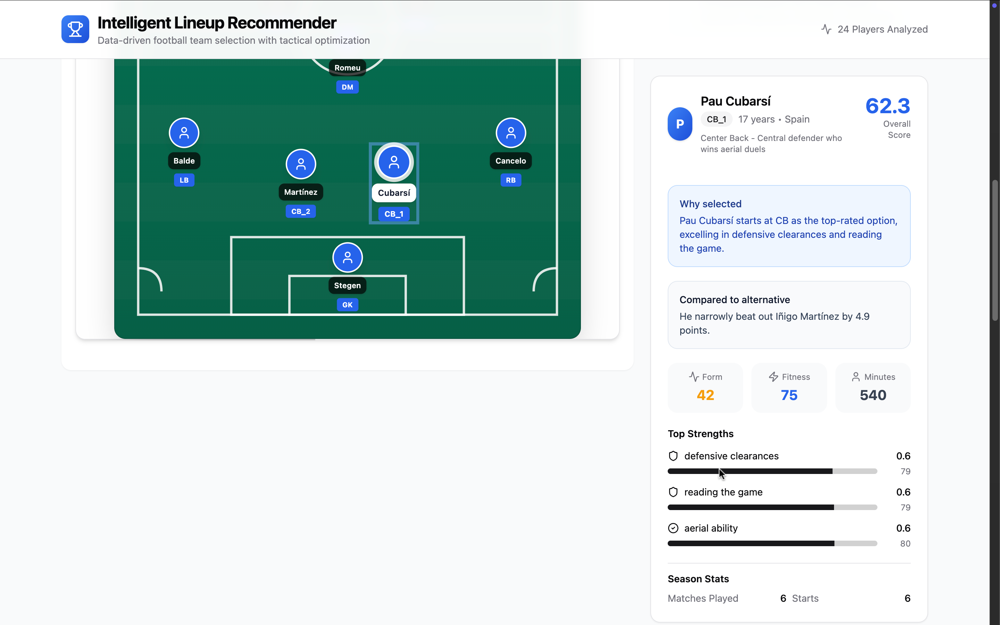
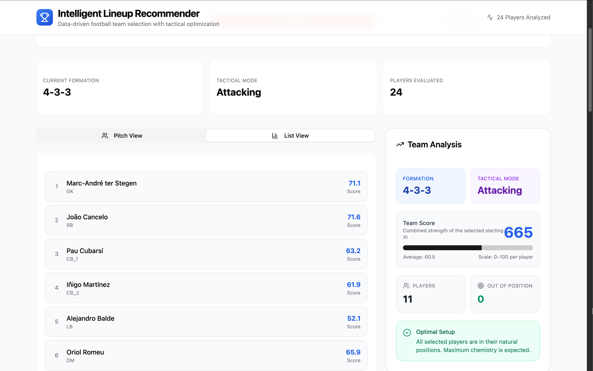
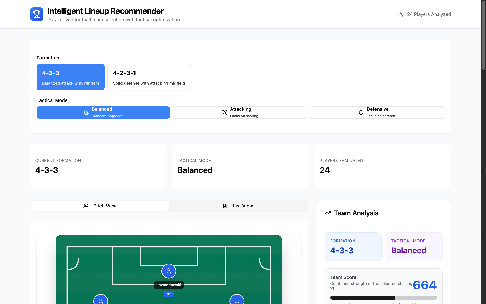
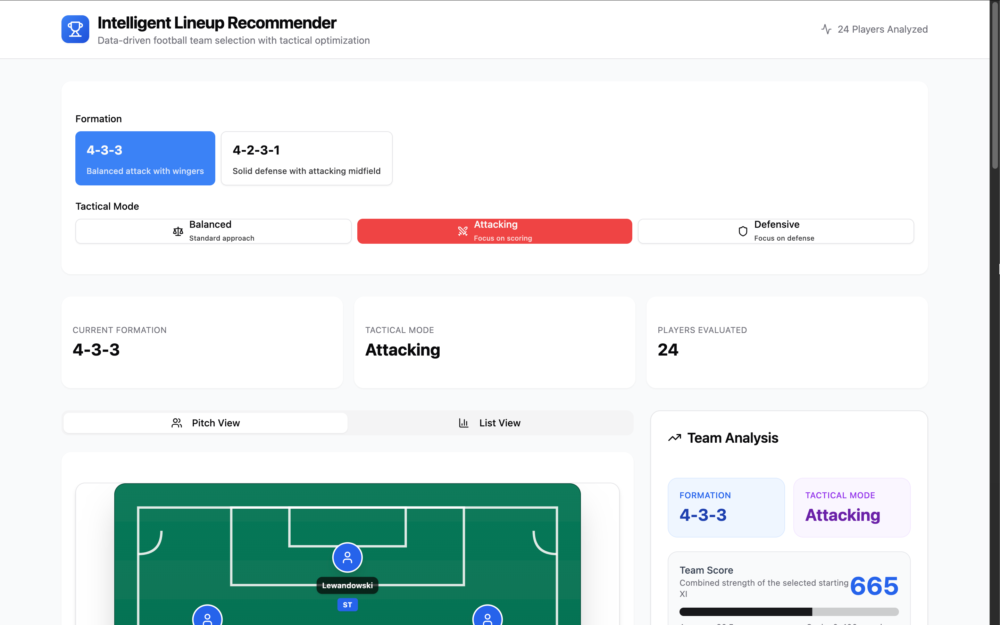
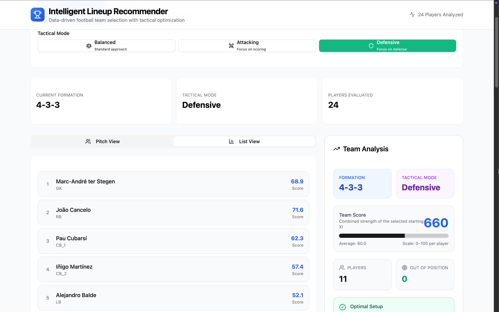

# ⚽ Intelligent Football Lineup Recommender

A data-driven web application that generates optimal football lineups using performance analytics, tactical constraints, and position-aware scoring.

Built with a focus on **real-world decision systems**, this project simulates how modern football teams leverage data to optimize squad selection and maximize on-field performance.

---

## 🚀 Overview

Selecting the best starting XI is a complex problem involving:

* Player form and fitness
* Tactical system compatibility
* Position specialization
* Team chemistry

This application solves that by combining structured data with a scoring engine to produce **intelligent, explainable lineup recommendations**.

---

## ✨ Key Features

### 🧠 Intelligent Lineup Generation

* Automatically selects the best XI based on performance metrics
* Considers player strengths, recent form, and fitness

### ⚙️ Tactical Flexibility

* Supports multiple formations:

  * 4-3-3
  * 4-2-3-1
  * 4-4-2
* Switch between tactical modes:

  * Balanced
  * Attacking
  * Defensive

### 🟢 Interactive Pitch Visualization

* Real-time lineup rendered on a football pitch
* Click any player to view detailed analysis
* Visual indicators for out-of-position players

### 👤 Player Intelligence Panel

* Explainable selection reasoning
* Key strengths and contribution breakdown
* Form, fitness, and match statistics
* Comparison with alternative players

### 📊 Team Analysis Dashboard

* Overall team score and average rating
* Chemistry insights
* Position mismatch detection
* Clear performance indicators

### 🔄 Formation Comparison Engine

* Compare formations across tactical modes
* Identify optimal setups based on scoring output

---

## 📸 Screenshots
## 🖥️ Live Interface Preview

### 🟢 Pitch View


### 👤 Player Analysis


### 📊 Team Analysis


### ⚙️ Tactical Modes

**Balanced**


**Attacking**


**Defensive**


---

## 🧩 Architecture & Design

This project is structured to mimic a **real production frontend**:

```id="code1"
src/
  components/        # UI components (modular & reusable)
  hooks/             # Data layer (custom React hooks)
  types/             # Strong TypeScript typing
  data/              # Structured input datasets
```

### Key Design Decisions

* **Separation of concerns**: data logic isolated in hooks (`useData`)
* **Type safety**: full TypeScript coverage for reliability
* **Composable UI**: reusable components for scalability
* **Explainability-first**: every decision is backed by clear reasoning

---

## 🛠️ Tech Stack

* **React + TypeScript** — scalable, type-safe UI
* **Vite** — fast build tooling
* **Tailwind CSS** — utility-first styling
* **ShadCN UI** — modern component system
* **Lucide Icons** — clean iconography

---

## ▶️ Getting Started

```bash
npm install
npm run dev
```

---

## 💡 What This Project Demonstrates

This is not just a UI — it demonstrates:

* Designing **data-driven decision systems**
* Translating complex logic into intuitive UX
* Building **interactive analytical dashboards**
* Writing **clean, maintainable React architecture**
* Creating **production-quality UI under time constraints**

---

## 📌 Future Improvements

* Live API integration (real player stats)
* Advanced metrics (xG, xA, heatmaps)
* Drag-and-drop lineup editing
* Authentication & team management
* Deployment with real-time updates

---

## 👤 Author

**Rania Bezzar**

---

## ⭐ Why This Matters

Modern football is driven by data.

This project reflects how software can bridge the gap between:

* raw performance metrics
* tactical decision-making
* and user-friendly insights

It’s a step toward building tools used in real-world sports analytics environments.
